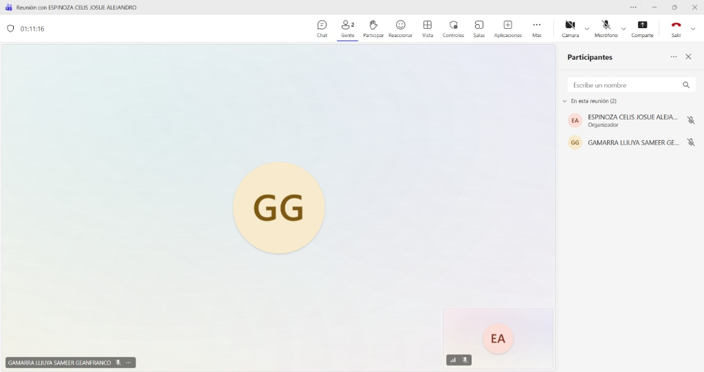
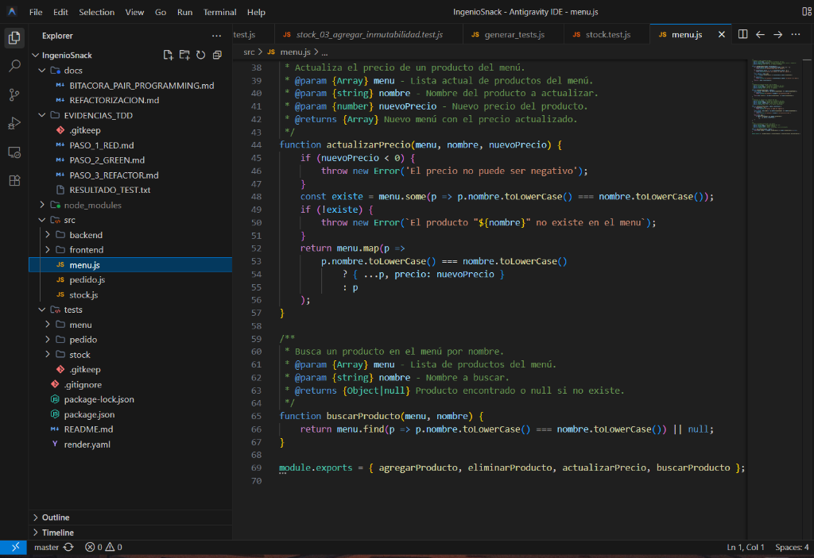
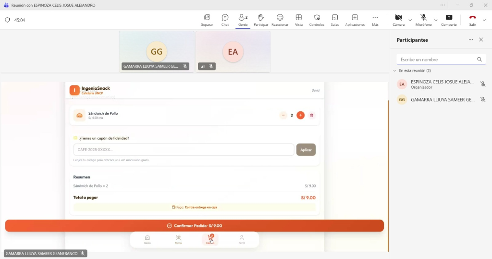
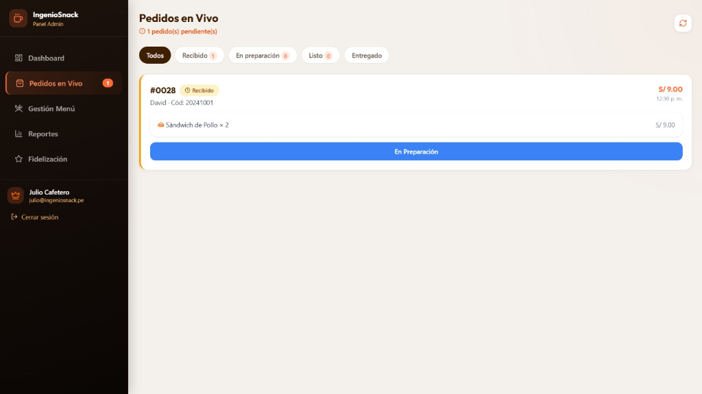
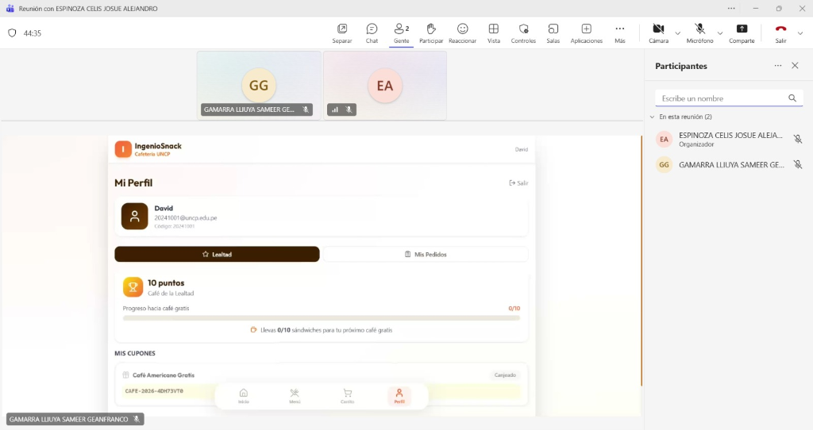

# Bitácora de Pair Programming

*Fecha:* 15 de Junio de 2026
*Integrantes:*
- Josue Alejandro Espinoza Celis
- Sameer Geanfranco Gamarra LLiuya

## Sesión 1: Pruebas de Flujo de Pedidos y Fidelización
- **Rol Conductor (Driver):** Josue Alejandro Espinoza Celis (Desarrollador)
- **Rol Copiloto (Navigator / Cliente):** Sameer Geanfranco Gamarra LLiuya

- **Tareas realizadas:**
  1. **Prueba del Carrito de Compras:** Simulamos el rol de un estudiante (David). Agregamos productos al carrito (2 Sándwiches de Pollo) validando el cálculo correcto del subtotal (S/ 9.00).
     
  2. **Prueba del Sistema de Cupones:** En la misma vista del carrito, probamos el campo de ingreso de cupones de fidelidad (ej. para canjear un café americano gratis).
  3. **Revisión del Panel de Administrador:** Cambiamos de rol al dueño de la cafetería (Julio Cafetero). Verificamos que el pedido entrara correctamente a la vista de "Pedidos en Vivo" (Pedido #0028) y validamos el flujo de cambiar el estado a "En Preparación".
     
  4. **Validación del Perfil y Fidelidad:** Revisamos la vista "Mi Perfil" del usuario, confirmando que el sistema registra los puntos acumulados (10 puntos para el Café de la Lealtad) y muestra el historial de cupones canjeados correctamente.
     
- **Duración:** ~1 hora y 15 minutos (según tiempo de reunión).
- **Observaciones/Reflexiones:**
  - *Sameer (Cliente):* Validó que la interfaz es intuitiva tanto para hacer el pedido como para canjear los cupones. El sistema de puntos de fidelidad se actualiza correctamente y motiva a seguir comprando.
  - *Josue (Desarrollador):* La reunión fue muy útil para comprobar que la lógica de negocio construida mediante TDD en el backend (cálculos de pedidos, descuentos) se refleja correctamente y sin errores en la interfaz de usuario frontend. El flujo de comunicación entre el carrito del cliente y el dashboard en vivo del administrador funciona a la perfección.
