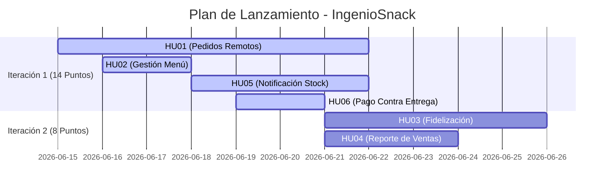

# 🎓 UNIVERSIDAD NACIONAL DEL CENTRO DEL PERÚ
## **Facultad de Ingeniería de Sistemas**

**Asignatura:** Metodología del Desarrollo de Software  
**Caso de Estudio:** "IngenioSnack" - La Cafetería Ágil de la FIS  
**Semestre:** Quinto | **NRC:** IS055B  
**Año:** 2026

### **Integrantes:**
* **Escobar Caysahuana Jack Rener** (Estudiante - UNCP)
* **Espinoza Celis Josue Alejandro** (Estudiante - UNCP)
* **Vera Onsihuay, Didier Mirko** (Estudiante - UNCP)
* **Rutti Bendezu Luis Angel** (Estudiante - UNCP)
* **Gamarra Lliuya Sameer** (Estudiante - UNCP)

---

## 📝 Problemática

La zona comercial **"IngenioSnack"**, estratégicamente situada junto a los laboratorios de la Facultad de Ingeniería de Sistemas (FIS), presenta una grave caída en su capacidad de expansión. En la ventana de mayor concurrencia, que corresponde con la hora de recreo, el sistema sufre un severo cuello de botella logístico. Las solicitudes se atienden en un sistema analógico y monolítico de un único hilo: una libreta de papel que sólo maneja el Sr. Julio.

Esta arquitectura obsoleta produce “colas infinitas” (alta latencia del servicio) que genera un *timeout* inaceptable para los usuarios finales: estudiantes que pierden su hora de almuerzo o tienen que retrasar su siguiente clase. Así pues, la tasa de abandono (*churn rate*) se ha disparado, lo que ha provocado una fuga de capital hacia nodos competidores (otras cafeterías de la universidad). Además, la ausencia de un sistema de sincronización de inventario en tiempo real genera excepciones de “fuera de stock” en medio de la transacción. 

> [!IMPORTANT]
> ¡Migrar a una solución digital ágil que asincronice los pedidos y descentralice el flujo de atención es un imperativo técnico!

---

## 🎯 1. Extracción de Historias de Usuario (HU)

### **HU01: Realizar Pedidos de Forma Remota**
| **Atributo** | **Detalle** |
| :--- | :--- |
| **Rol** | Alumno |
| **Quiero** | Pedir mi sándwich desde mi celular antes de terminar la clase. |
| **Para** | Recogerlo rápidamente al salir. |
| **Criterios de Aceptación** | 1. El alumno puede visualizar el menú disponible desde su celular. 2. El alumno puede seleccionar los productos deseados. 3. El sistema registra correctamente el pedido. 4. El alumno recibe una confirmación de que su pedido fue realizado exitosamente. |

---

### **HU02: Gestión de Disponibilidad del Menú**
| **Atributo** | **Detalle** |
| :--- | :--- |
| **Rol** | Dueño de la cafetería |
| **Quiero** | Habilitar o deshabilitar productos del menú según la disponibilidad de ingredientes. |
| **Para** | Evitar ofrecer productos que no puedo preparar. |
| **Criterios de Aceptación** | 1. El dueño puede cambiar el estado de un producto entre disponible y no disponible. 2. Los productos deshabilitados no aparecen en el menú para los alumnos. 3. Los cambios se reflejan inmediatamente en el sistema. 4. El sistema guarda el historial de disponibilidad de los productos. |

---

### **HU03: Programa de Fidelización y Recompensas**
| **Atributo** | **Detalle** |
| :--- | :--- |
| **Rol** | Dueño de la cafetería |
| **Quiero** | Registrar y contabilizar las compras de sándwiches realizadas por mis clientes. |
| **Para** | Otorgar automáticamente un café americano gratis cada 10 compras. |
| **Criterios de Aceptación** | 1. El sistema registra cada compra realizada por un cliente. 2. El sistema lleva un conteo acumulado de compras por cliente. 3. Al completar 10 compras, el sistema genera automáticamente una recompensa. 4. El cliente es notificado de que obtuvo un café americano gratuito. |
| **Notas y Acuerdos** | * **Identificación del Cliente:** Se acordó con el equipo que el estudiante se identificará de forma única en el sistema mediante su **Código Universitario de la UNCP** para vincular y asegurar sus sellos digitales correctamente. * **Alcance de la Recompensa:** Siguiendo la petición explícita del Sr. Julio, la recompensa aplica **únicamente para un café americano tradicional**; no es intercambiable por sándwiches, gaseosas u otros productos de mayor costo. |

---

### **HU04: Reporte de Productos Más Vendidos**
| **Atributo** | **Detalle** |
| :--- | :--- |
| **Rol** | Dueño de la cafetería |
| **Quiero** | Visualizar los productos más vendidos durante los días de examen. |
| **Para** | Contar con la cantidad suficiente de ingredientes y atender la demanda. |
| **Criterios de Aceptación** | 1. El sistema muestra un reporte de los productos más vendidos. 2. El dueño puede consultar las ventas por fecha o período. 3. El reporte puede visualizarse desde un dispositivo móvil. 4. La información se actualiza con base en las ventas registradas. |

---

### **HU05: Notificación de Stock Agotado**
| **Atributo** | **Detalle** |
| :--- | :--- |
| **Rol** | Cliente |
| **Quiero** | Conocer si un menú se encuentra agotado. |
| **Para** | Poder elegir otra opción disponible. |
| **Criterios de Aceptación** | 1. El sistema identifica los productos sin disponibilidad. 2. El cliente recibe una notificación cuando un producto está agotado. 3. El sistema impide realizar pedidos de productos no disponibles. 4. El cliente puede seleccionar otro producto disponible del menú. |

---

### **HU06: Pago Contra Entrega (Flujo Offline/Efectivo)**
| **Atributo** | **Detalle** |
| :--- | :--- |
| **Rol** | Dueño de la cafetería |
| **Quiero** | Que los pedidos se paguen contra entrega al momento de recogerlos. |
| **Para** | Evitar la integración con plataformas bancarias. |
| **Criterios de Aceptación** | 1. El sistema registra los pedidos sin solicitar pago en línea. 2. El pedido queda marcado como "pendiente de pago". 3. El pago se registra únicamente al momento de la entrega. 4. El dueño puede confirmar que el pedido fue pagado en efectivo. 5. El sistema actualiza el estado del pedido a "pagado" una vez registrado el cobro. |
| **Notas y Acuerdos** | * **Decisión del Negocio:** Se respeta estrictamente la decisión del Sr. Julio de **no integrar pasarelas de pago ni bancos** en esta primera iteración; todo el flujo financiero es manual y contra entrega al momento del recojo. |

---

## 🎲 2. Estimación Ágil (Planning Poker)

En la estimación ágil se utilizó la **escala de Fibonacci** para asignar los puntos de historia (indican esfuerzo relativo, complejidad e incertidumbre):
$$\text{Escala Utilizada: } 1, 2, 3, 5, 8, 13, 21$$

### 🗓️ Iteración 1: Core del MVP (Flujo Básico de Pedidos y Stock)
Esta iteración se enfoca en resolver el cuello de botella principal: digitalizar el menú, permitir pedidos móviles sin pasarelas de pago complejas y gestionar existencias en tiempo real.

| Código HU | Título de la Historia de Usuario | Complejidad (Fibonacci) | Justificación de Estimación |
| :---: | :--- | :---: | :--- |
| **HU01** | Realizar Pedidos de Forma Remota | **5** | Alta complejidad por la sincronización inicial del menú, control del flujo del estado de los pedidos y frontend responsivo. |
| **HU02** | Gestión de Disponibilidad del Menú | **2** | Esfuerzo menor. Lógica CRUD básica en base de datos para conmutar el campo `activo`/`inactivo` de los productos. |
| **HU05** | Notificación de Stock Agotado | **5** | Requiere sincronización en tiempo real (Sockets) al momento de agotar inventario y validaciones concurrentes. |
| **HU06** | Pago Contra Entrega | **2** | Lógica directa. Registro del estado de pago simple sin integración con APIs bancarias o pasarelas de pago. |
| | **TOTAL ITERACIÓN 1** | **14 Puntos** | |

---

### 🗓️ Iteración 2: Fidelización y Reportes de Gestión
Esta iteración añade valor agregado sobre la base estable del MVP: incentiva la retención mediante premios y permite al Sr. Julio tomar decisiones de abastecimiento.

| Código HU | Título de la Historia de Usuario | Complejidad (Fibonacci) | Justificación de Estimación |
| :---: | :--- | :---: | :--- |
| **HU03** | Programa de Fidelización (Café Gratis) | **5** | Complejidad media-alta. Requiere triggers en base de datos o lógica de negocio para validar la compra #10, emitir cupones y llevar el historial de puntos. |
| **HU04** | Reporte de Productos Más Vendidos | **3** | Complejidad media. Consultas agregadas (GROUP BY/COUNT) filtradas por rango de fechas y representadas en gráficos dinámicos. |
| | **TOTAL ITERACIÓN 2** | **8 Puntos** | |

*(Nota: En la lista de requerimientos original se repetía HU03 en la Iteración 2 con 3 puntos; se ha corregido el código de la historia para HU04 ya que se refiere al reporte de productos más vendidos durante los días de examen).*

---

### 📊 Resumen General del Proyecto

