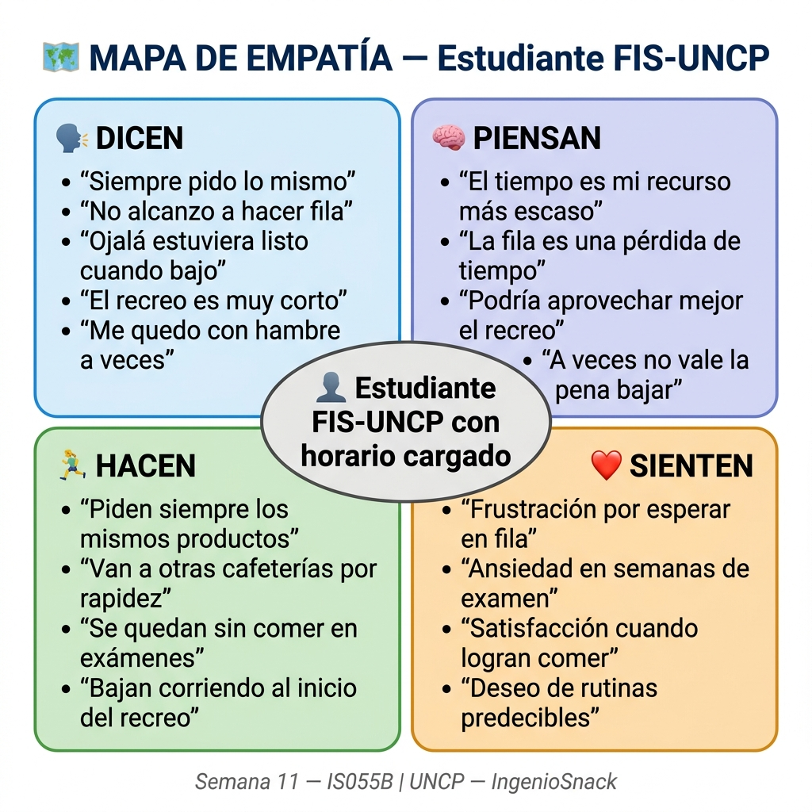
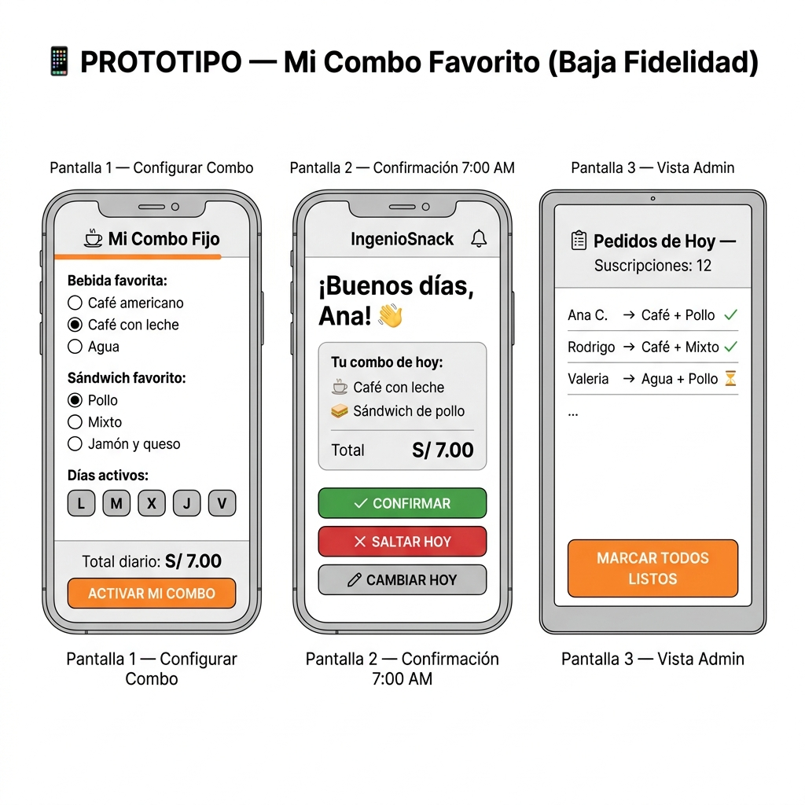

# 🎨 DESIGN THINKING — IngenioSnack
## Semana 11 — IS055B Metodología de Desarrollo de Software
**Universidad Nacional del Centro del Perú — Facultad de Ingeniería de Sistemas**
**Fecha:** 09/06/2026
**Integrantes:** [Equipo IS055B — Grupo IngenioSnack]

---

## 🎯 Reto de Diseño

> ¿Cómo podemos ayudar a los estudiantes de la FIS a alimentarse bien durante su recreo sin perder tiempo, para que puedan rendir mejor académicamente?

---

## FASE 1: EMPATIZAR 🤝

### Metodología de Investigación
Se realizaron **5 entrevistas cortas** (5 minutos cada una) a estudiantes de la FIS de la UNCP durante el recreo del día 06/06/2026, combinando preguntas directas y observación de comportamiento.

### Perfil de Entrevistados
| # | Nombre | Ciclo | Carrera | Frecuencia en cafetería |
|---|--------|-------|---------|------------------------|
| 1 | Ana C. | 5to ciclo | Ing. Sistemas | Todos los días |
| 2 | Carlos M. | 3er ciclo | Ing. Sistemas | 3 veces/semana |
| 3 | Lucía P. | 7mo ciclo | Ing. Sistemas | Solo en exámenes |
| 4 | Rodrigo T. | 4to ciclo | Ing. Sistemas | Todos los días |
| 5 | Valeria H. | 6to ciclo | Ing. Sistemas | 4 veces/semana |

### Preguntas de la Entrevista
1. ¿Qué haces durante el recreo del mediodía?
2. ¿Qué compras normalmente en la cafetería?
3. ¿Qué es lo que más te frustra de la cafetería?
4. ¿Qué harías diferente si pudieras cambiar algo?
5. ¿Pedirías siempre lo mismo si pudieras prepagarlo?

### Hallazgos Clave de las Entrevistas
- **Ana:** "Siempre pido lo mismo: café con leche y sándwich de pollo. Odio hacer fila para algo que sé que voy a pedir."
- **Carlos:** "A veces no bajo porque sé que en 10 minutos no alcanzo. Me quedo con hambre."
- **Lucía:** "En semana de exámenes me olvido de comer. Ojalá alguien me preparara algo automáticamente."
- **Rodrigo:** "Ya sé mi pedido de memoria. Sería genial que solo baje a recoger."
- **Valeria:** "Preferiría tener todo listo antes de bajar. El tiempo del recreo es poco."

---

### 🗺️ MAPA DE EMPATÍA

> *Ver archivo visual: `MAPA_EMPATIA.png`*



| Cuadrante | Hallazgos |
|-----------|-----------|
| **DICEN** 🗣️ | "Siempre pido lo mismo" / "No alcanzo a hacer fila" / "Ojalá estuviera listo" / "Me quedo con hambre" / "El recreo es muy corto" |
| **PIENSAN** 🧠 | Que el tiempo es su recurso más escaso / Que la fila es una pérdida de tiempo / Que podrían aprovechar mejor su recreo / Que a veces no vale la pena bajar |
| **HACEN** 🏃 | Piden siempre lo mismo / Se van a otras cafeterías / Se quedan sin comer / Bajan corriendo al recreo / Compran en tiendas fuera de la facultad |
| **SIENTEN** ❤️ | Frustración por esperar en fila / Ansiedad en semanas de examen / Satisfacción cuando logran comer / Resignación cuando no alcanzan / Deseo de rutinas predecibles |

**Dolores principales identificados:**
1. ⏰ **Tiempo:** El recreo de 1 hora no alcanza si hay fila larga
2. 🔄 **Rutina:** La mayoría pide siempre los mismos productos
3. 🧪 **Exámenes:** En época de parciales el problema se intensifica
4. 💸 **Dinero:** Prefieren pagar en efectivo, desconfían de pagos online

---

## FASE 2: DEFINIR 🎯

### Point of View (POV) — Declaración del Problema

> **"El estudiante de la FIS-UNCP que tiene clases seguidas necesita una forma de tener su desayuno o almuerzo listo en la cafetería IngenioSnack antes de que inicie el recreo, porque dedica demasiado tiempo haciendo fila para pedir siempre lo mismo, lo que le hace llegar tarde a clases o quedarse sin comer."**

### Desglose del POV
| Componente | Descripción |
|------------|-------------|
| **Usuario** | Estudiante de la FIS-UNCP con horario cargado |
| **Necesidad** | Obtener su comida habitual sin perder tiempo en fila |
| **Insight** | La mayoría tiene un pedido recurrente y predecible |
| **Por qué importa** | Impacta su rendimiento académico y bienestar físico |

### Preguntas "¿Cómo podríamos...?" (HMW)
- ¿Cómo podríamos hacer que el pedido del estudiante esté listo ANTES de que baje?
- ¿Cómo podríamos automatizar el pedido recurrente sin que el estudiante lo haga a diario?
- ¿Cómo podríamos ayudar al Sr. Julio a prepararse con anticipación?
- ¿Cómo podríamos premiar la fidelidad de los estudiantes que siempre piden lo mismo?

---

## FASE 3: IDEAR 💡

### Técnica: CRAZY 8s (8 ideas en 8 minutos)
*Cada integrante propuso ideas sin filtros. Luego se combinaron las mejores.*

### 10 Ideas Generadas (Lista Completa)

| # | Idea | Descripción breve |
|---|------|-------------------|
| 1 | 🔔 **Suscripción "Mi Combo Fijo"** | El estudiante elige un combo fijo semanal y el sistema lo prepara automáticamente cada día |
| 2 | 📦 **Caja Sorpresa de Exámenes** | Pack semanal de snacks energéticos que se activa en semanas de parciales |
| 3 | ⏱️ **Pedido con 30 min de anticipación** | Sistema de alerta que notifica al Sr. Julio con media hora de antelación |
| 4 | 🎮 **Gamificación extrema** | Los estudiantes ganan XP y desbloquean descuentos por rachas de pedidos diarios |
| 5 | 🤝 **Pedido grupal por aula** | Un delegado por salón recoge el pedido de todos y lo envía junto |
| 6 | 🚚 **Delivery al salón** | El Sr. Julio lleva los pedidos directamente al aula durante el recreo |
| 7 | 🤖 **Bot de WhatsApp** | El estudiante confirma su pedido del día enviando "1" al WhatsApp del Sr. Julio |
| 8 | 💳 **Monedero prepago IngenioSnack** | Los estudiantes cargan saldo al inicio de la semana y descontamos por pedido |
| 9 | 📅 **Menú semanal anticipado** | El Sr. Julio publica el menú el lunes y los estudiantes reservan para toda la semana |
| 10 | 🌟 **Plan VIP para tesistas** | Los estudiantes en tesis tienen una línea express con beneficios especiales |

### Votación del Equipo — Top 2 Seleccionadas

**🏆 GANADORA: Idea #1 — Suscripción "Mi Combo Fijo"**
- Votos: 4/5 integrantes
- Razón: Es automatizable, genera ingresos recurrentes predecibles, resuelve el problema de la rutina, y es escalable a otras facultades.

**🥈 SEGUNDA: Idea #7 — Bot de WhatsApp**
- Votos: 3/5 integrantes
- Razón: Bajo costo de implementación, los estudiantes ya usan WhatsApp, el Sr. Julio puede empezar sin sistema.

---

## FASE 4: PROTOTIPAR 🖼️

### Solución Elegida: **"Mi Combo Fijo" — Sistema de Suscripción Diaria**

#### Descripción del Prototipo
Se diseñó un **wireframe digital de baja fidelidad** (ver `PROTOTIPO.png`) que muestra las pantallas principales del flujo de suscripción para el estudiante.

#### Pantallas del Prototipo (Referencia textual)

**Pantalla 1 — Configurar Mi Suscripción**
```
┌─────────────────────────┐
│  ☕ Mi Combo Fijo        │
│─────────────────────────│
│  Bebida favorita:        │
│  ○ Café americano        │
│  ● Café con leche        │
│  ○ Agua                  │
│                          │
│  Sándwich favorito:      │
│  ● Pollo                 │
│  ○ Mixto                 │
│  ○ Jamón y queso         │
│                          │
│  Días activos:           │
│  [L] [M] [X] [J] [V]   │
│                          │
│  Total diario: S/ 7.00  │
│  [ACTIVAR SUSCRIPCIÓN]  │
└─────────────────────────┘
```

**Pantalla 2 — Confirmación Diaria (7:00 AM)**
```
┌─────────────────────────┐
│  🔔 IngenioSnack         │
│─────────────────────────│
│  ¡Buenos días, Ana! 👋  │
│                          │
│  Tu combo de hoy:        │
│  ☕ Café con leche        │
│  🥪 Sándwich de pollo    │
│  Total: S/ 7.00          │
│                          │
│  [✓ CONFIRMAR]           │
│  [✗ SALTAR HOY]          │
│  [✏ CAMBIAR HOY]         │
└─────────────────────────┘
```

**Pantalla 3 — Admin: Vista de Suscripciones del Día**
```
┌─────────────────────────┐
│  📋 Pedidos de Hoy       │
│  Suscripciones: 12       │
│─────────────────────────│
│  Ana C.  → Café+Pollo   │
│  Rodrigo → Café+Mixto   │
│  Valeria → Agua+Pollo   │
│  ...                     │
│  [MARCAR LISTOS]         │
└─────────────────────────┘
```

> *Ver wireframe visual en `PROTOTIPO.png`*



#### Herramienta Usada
Wireframe creado con herramienta de diseño digital y exportado como imagen PNG (ver `PROTOTIPO.png`).

---

## FASE 5: TESTEAR ✅

### Metodología de Testing
Se presentó el prototipo en papel a **2 estudiantes reales** de la FIS durante el recreo del 06/06/2026.

### Resultados del Testing

| Criterio | Estudiante 1: Ana C. (5to ciclo) | Estudiante 2: Rodrigo T. (4to ciclo) |
|----------|----------------------------------|--------------------------------------|
| **Qué le GUSTÓ** | "Poder elegir mis días activos. No siempre vengo los viernes." / "La confirmación a las 7am está genial, me recuerda." | "Que pueda cambiar el pedido del día si quiero algo diferente." / "El total diario visible es útil para mi presupuesto." |
| **Qué NO le gustó** | "¿Y si me quedo sin saldo? ¿Qué pasa?" / "No veo cómo cancelar la suscripción si quiero." | "El botón 'ACTIVAR SUSCRIPCIÓN' suena a contrato. Prefiero 'Guardar mi combo'." / "¿Puedo cambiar mi combo cada semana?" |
| **Dudas que tuvo** | ¿El pago es adelantado o al recoger? / ¿Qué pasa si el producto se acaba? | ¿Puedo tener 2 combos diferentes? / ¿Me avisan si cambia el precio? |

### Insights del Testing
1. **Lenguaje:** Evitar palabras como "suscripción" o "contrato". Usar "Mi Combo Favorito".
2. **Pago:** Mantener pago contra entrega para no generar desconfianza.
3. **Flexibilidad:** Debe ser fácil pausar, cambiar o cancelar el combo.
4. **Stock:** El sistema debe avisarles si su producto del día está agotado.

### Decisión Post-Testing
✅ **Perseverar con la idea** — La respuesta fue muy positiva. Se ajustará el lenguaje y se añadirá la opción de "pausar combo" antes de implementar.

---

## 📊 Resumen Ejecutivo del Design Thinking

| Fase | Herramienta | Resultado |
|------|-------------|-----------|
| Empatizar | 5 entrevistas + observación | Mapa de Empatía completo |
| Definir | POV + HMW | Problema central identificado |
| Idear | Crazy 8s + votación | 10 ideas → 2 finalistas |
| Prototipar | Wireframe digital | 3 pantallas principales |
| Testear | 2 usuarios reales | Feedback accionable recogido |

**Idea seleccionada:** Sistema de Suscripción Diaria "Mi Combo Favorito"
**Siguiente paso:** Lean Startup — Validar si el estudiante PAGARÍA por esto.

---
*Semana 11 — IS055B Metodología de Desarrollo de Software*
*UNCP — Facultad de Ingeniería de Sistemas — Huancayo, Perú*
*Fecha: 09/06/2026*
