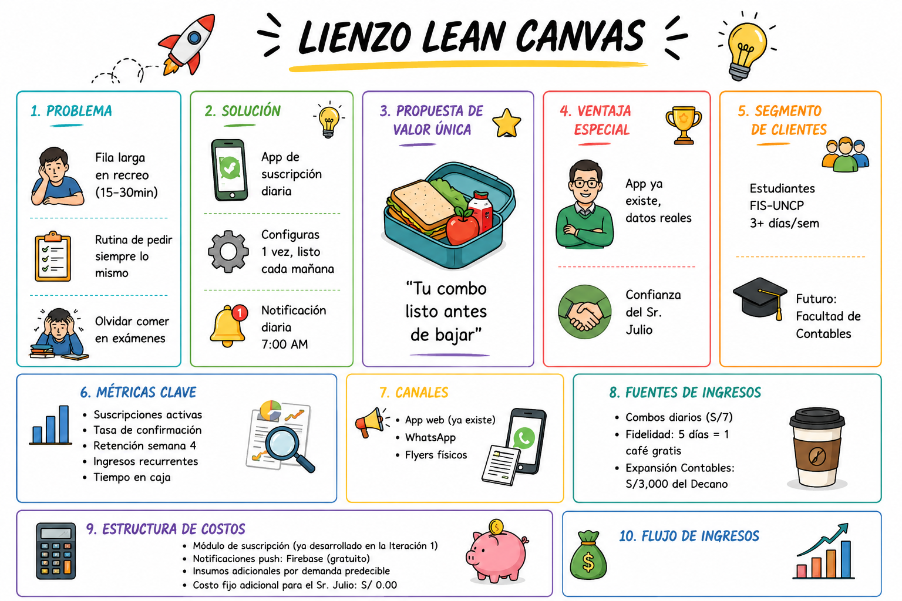

# 📊 LEAN CANVAS — IngenioSnack
## Nuevo Servicio: "Mi Combo Favorito" — Suscripción Diaria
### Semana 12 — IS055B | UNCP — Facultad de Ingeniería de Sistemas

---

## 🗺️ El Lienzo Lean Startup (9 Bloques)

| Bloque | Contenido |
|--------|-----------|
| **1. PROBLEMA** | Los estudiantes de la FIS-UNCP pierden entre 15-30 min de su recreo haciendo fila para comprar siempre los mismos productos. En semanas de examen esto empeora y muchos terminan sin comer. |
| **2. SEGMENTO DE CLIENTES** | **Primario:** Estudiantes de la FIS-UNCP que asisten al menos 3 días/semana a la cafetería y tienen un pedido recurrente fijo. (~60-80 estudiantes diarios). **Secundario (futuro):** Estudiantes de la Facultad de Ciencias Contables. |
| **3. PROPUESTA DE VALOR ÚNICA** | "Tu desayuno favorito listo antes de que suene el timbre. Sin fila, sin esperar, sin pensar." — Un combo personalizado que se prepara automáticamente cada día que tú eliges. |
| **4. SOLUCIÓN** | Sistema web/móvil que permite al estudiante configurar su "Combo Favorito" una sola vez. Cada mañana recibe una notificación de confirmación. Al bajar al recreo, su pedido ya está listo. Pago contra entrega al recoger. |
| **5. CANALES** | App web (ya existe desde Iteración 1) / Notificaciones push en el celular / WhatsApp como canal alternativo / Flyers físicos en los pasillos de la FIS |
| **6. FUENTES DE INGRESOS** | Venta directa de combos diarios (precio combo = precio normal, sin recargo) / Posible descuento de fidelidad: combo de 5 días = 1 café gratis / Expansión a Contables: +S/ 3,000 de inversión del Decano |
| **7. ESTRUCTURA DE COSTOS** | Desarrollo de módulo de suscripción en el sistema existente (ya desarrollado) / Notificaciones push (servicio gratuito con Firebase) / Costo de insumos adicionales por predicción de demanda / Sin costo fijo adicional para el Sr. Julio |
| **8. MÉTRICAS CLAVE** | Nº de suscripciones activas por semana / Tasa de confirmación diaria (cuántos confirman vs. saltan) / Tasa de retención a la semana 4 / Ingresos recurrentes semanales / Tiempo promedio de atención en caja (debe reducirse) |
| **9. VENTAJA INJUSTA** | El sistema ya existe (Iteración 1) — agregar suscripción es incremental, no una construcción desde cero. La relación de confianza del Sr. Julio con los estudiantes de la FIS es insustituible. Los datos históricos de pedidos de la Iteración 1 ya permiten predecir qué combinará mejor. |

---

## 🔍 Análisis Profundo de Bloques Clave

### 1️⃣ Problema (Detallado)

**Top 3 problemas por orden de urgencia:**
1. ⏰ **Tiempo perdido en fila** (15-30 min de 60 disponibles = 25-50% del recreo)
2. 🔄 **Fricción de decidir/pedir lo mismo todos los días** (fatiga de decisión)
3. 🧪 **En exámenes:** el estrés hace que los estudiantes se olviden de comer

**Soluciones alternativas actuales (competencia indirecta):**
- Otras cafeterías dentro de la universidad
- Tiendas fuera del campus
- Traer comida de casa
- No comer (opción más común en exámenes)

---

### 3️⃣ Propuesta de Valor Única (UVP)

> **"El único lugar donde tu almuerzo ya está listo cuando bajas. Sin fila. Sin esperar. Sin pensar."**

**Diferenciadores clave:**
- **Personalización:** el combo es exactamente lo que el estudiante quiere
- **Anticipación:** listo ANTES de que baje, no mientras espera
- **Confianza:** paga al recoger, no adelantado
- **Simplicidad:** configura una vez, funciona todos los días

---

### 9️⃣ Ventaja Injusta (Defensible Moat)

| # | Ventaja | Por qué es difícil de copiar |
|---|---------|------------------------------|
| 1 | **Base instalada** | Ya tienen la app de la Iteración 1 funcionando con usuarios reales |
| 2 | **Datos de comportamiento** | Saben qué piden los estudiantes y cuándo (2 meses de operación) |
| 3 | **Confianza del Sr. Julio** | Construida en 2 meses de operación diaria |
| 4 | **Localización exclusiva** | Justo al lado de los laboratorios de la FIS |
| 5 | **Conocimiento del contexto** | Saben cuándo son los exámenes y parciales de la UNCP |

---

## 📐 Representación Visual del Canvas
> *Ver archivo visual: `LIENZO_LEAN_CANVAS.png`*

---
*Semana 12 — IS055B Metodología de Desarrollo de Software*
*UNCP — Facultad de Ingeniería de Sistemas — Huancayo, Perú*
*Fecha: 09/06/2026*
